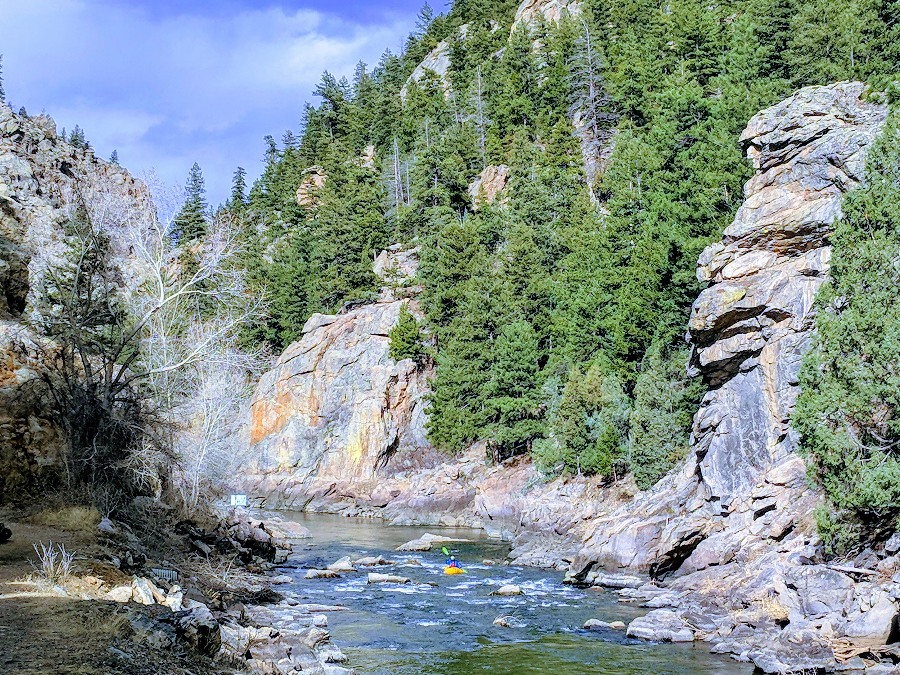

This scenic section of river is a perfect playground for an intermediate front range packrafter.  It often can have runnable flows from March all the way into October, and it is only around 1 hour from Denver.  I have packrafted it everywhere between 220 and 1,200 cfs.  At all flows, it is a pretty difficult section, and I can attest, that it certainly is not the place for beginners.

## Information

 - Although this section of river is very short, at only around one mile, it packs four main rapids into this stretch.  The last 3 all fall into the final 1/3 of the mile, which makes for a great spot to hang out and run some laps.
   - There is no road for a shuttle, but there is a nice wide trail that can be used to hike back.  It also allows you to scout the entire run from the path.
 - **Low flow** - Below 350 cfs, the run is technical, boney and filled with sharp, exposed rocks.
 - **Med flow** - As the flow starts to move above 500, the current really picks up and it starts get a little more pushy. The entire run is fairly committing, and at flows above 700 especially, it can be difficult to catch eddies, or to rescue a swimmer.  The current moves fast, and the rapids are pretty continuous at that level.
 -  **High flow** - Over 1,000 cfs the holes start to become very powerful, especially on Vertical Blender.  I had my packraft stuck in the entrance drop for over half an hour one time.  At these flows, the current will easily carry any lost gear out into the resevoir where it may not be recoverable.

## Video Footage

`youtube:ML4k8gcoNFY`

